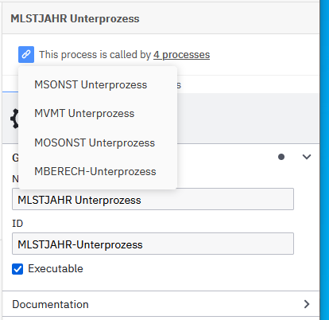

# Lohnsteuer nach Programmablaufplan
Programmablaufplan für Lohnsteuer in BPMN mit Camunda 8 automatisiert

Hier ist der original [Programmablaufplan](https://www.bundesfinanzministerium.de/Content/DE/Downloads/Steuern/Steuerarten/Lohnsteuer/Programmablaufplan/2022-05-20-geaenderte-PAP-2022-anwendung-ab-01-06-2022-anlage-1.pdf?__blob=publicationFile&v=2) für die maschinelle Berechnung
der vom Arbeitslohn einzubehaltenden Lohnsteuer, des Solidaritätszuschlags
und der Maßstabsteuer für die Kirchenlohnsteuer für 2022 

## Vorgehensweise
Ich habe die Programmablaufpläne aus der o.g. Dokumentation ohne Anpassung in BPMN nachmodelliert. Die Symbole wurde wie folgt übersetzt:
* Jeder Terminator (Oval) wird ein Ereignis (Start und Endereignis)
* Jede Operation (Rechteck) wird zu einer Aktivität. 
* Die Operationen sind ausnahmslos Zuweisungen, die als Name der Aktivität mit dem Verb "Setze" übernommen wurden. 
* Die Unterprogrammausführungen (Rechteck mit doppelten vertikalen Linien) werden zu Aufrufaktivitäten.
* Die Verzweigungen (Raute) werden zu Exclusiven Oder-Gateways. 
* Die Anmerkungen werden zu Textannotationen und Gruppierungen.

Hier ist ein Original Ablaufplan und der entstandene BPMN Prozess:

 

Um die Prozesse in Camunda 8 ausführen zu können, müssen technische Attribute aus der Beschreibung eingefügt werden. Hierbei bin ich wie folgt vorgegangen:
* Die Bedingung für die Verweigung wird immer in den "Ja" Sequenzfluss übernommen. (z.B. `WVFRB < 0`)
* Der "Nein" Sequenzfluss bekommt die logisch negierte Bedingung.   (z.B. `WVFRB >= 0`)
* Die Aktivität wird als Service-Task mit der Taskdefinition `noop` versehen und die Zuweisung wird als Output Mapping angelegt (z.B. `<zeebe:output source="=JRE4 / 100" target="ZRE4J" />`). Es wurde nur ein Worker für jeden Service-Task genutzt. Dieser Worker tut nichts und schließt die Aktivität sofort ab (No Operation). Die Operation wird über das Output-Mapping ausschließlich im BPMN-Diagramm abgelegt und gepflegt. Ein Bild dazu befindet sich unten.
* Die Aufrufaktivität wird direkt mit dem Unterprozess konfiguriert. Die Ergebnisse des Unterprozesses werden immer zurückgegeben (z.B. `<zeebe:calledElement processId="MLSTJAHR-Unterprozess" propagateAllChildVariables="true" />`. Ein Bild dazu befindet sich unten.

Für schnelles Feedback bei der Modellierung habe ich einen JUnit-Test erstellt, der den Lohnsteuerprozess durchläuft und diesen Test sukessive um  Eingabevariablen erweitert.

Die Baumstruktur mit den geschachtelten Unterprogrammen habe ich Stück für Stück, Unterprozess für Unterprozess umgesetzt. Der erste Prozess war der Lohsteuerprozess selbst. Für die Unterprozesse habe ich als Platzhalter zuerst einen NOOP-Unterprozess ohne Aktivitäten genutzt.

Die Unterprozesse bin ich nach der Depth-First Methode angegangen, ausgehend vom Hauptprozess.

Sobald ein Unterprozess ohne Fehler im Web-Modeler erstellt war, habe ich ihn exportiert, in mein Projekt übernommen und den Oberprozess angepasst. Mit dem JUnit Test bekam ich schnelles Feedback, ob der neue Unterprozess erfolgreich durchlaufen wurde. Die generierte Testabdeckung zeigte den Pfad durch den Prozess.

Wenn der Test nicht erfolgreich war, half die generierte Testabdeckung festzustellen, wo der Prozessablauf abgebrochen ist. Die häufigsten Fehlerquellen waren fehlende Eingabedaten (im Testcode ergänzt) und fehlende Datenrückgabe bei Unterprozessen (muss für jede Aufrufaktivität im Modeler aktiviert werden). Außerdem sind in den PDF-Vorlagen an einigen Stellen Bindestriche für Minuszeichen genutzt worden. 

Im Programmablaufplan MZTABFB fehlt die Initialisierung der Variable `EFA`. Hier habe ich eine Aktivität hinzugefügt, um den Wert vorher auf `0` zu setzen.   

## Testabdeckung
Der Prozess ist als Spring-Zeebe-Test mit Testabdeckung [hier zu finden](https://htmlpreview.github.io/?https://github.com/ingorichtsmeier/lohnsteuer-pap/blob/master/doc/testcoverage-static/com.camunda.consulting.lohnsteuer.TestLohnsteuerHauptprozess/report.html)

## Dauer
Ich habe insgesamt 2,5 Arbeitstage an den Prozessmodellen samt Test gearbeitet. An den Tagen habe ich auch die wiederkehrenden Tätigkeiten wie Emailbearbeitung durchgeführt. Geschätzt habe ich 13 Stunden an dem Projekt gearbeitet, bei 26 Modellen ergibt das im Schnitt 30 Minuten pro Unterprozess. 

Es war im nachhinein Vorteilhaft, alle Prozesse am Stück umzusetzen. Mit jedem Programmablaufplan habe ich mehr über die Lohnsteuer gelernt. Die Details wie Variablen- und Unterprgrammnamen kann man sich als Nicht-Cobol-Programmierer nur schwer merken. Bei längeren Pausen zwischen den Arbeiten (z.B. 1 Tag pro Woche) wären die Rüstzeiten für das eigene Gehirn deutlich länger und man muss länger nach bereits abgeschlossenen Teilen und genutzten Konventionen suchen.

## Vorteile bei der Umsetzung der Programmablaufpläne mit BPMN
* Sichtbare Nachverfolgung der ausgeführten Operationen
* Direkte Umsetzung ohne zusätzliche Programmierung möglich
* Sehr gut testbar
* Ausführung auf einer skalierbaren Umgebung (Camunda 8)
* Der Camunda Web-Modeler zeigt die Beziehungen zwischen Unterprozessen sehr gut auf:
    - Aus dem Oberprozess kann direkt in den Unterprozess gesprungen werden
    - Ein Unterprozess zeigt alle Oberprozesse, in denen er genutzt wurde.  

## Potentielle Überarbeitung
Die bisherige Modellierung setzt die Programmablaufpläne Eins-zu-Eins um. Dabei bleibt die Nomenklatur der Cobol-Programme und -Variablen erhalten.

Mit einer ausreichenden Testabdeckung kann man sich daran machen, die Prozesse zu überarbeiten.

Ideen dazu:
* Variablen mit sprechenden Namen versehen
* Unterprozesse mit sprechenden Namen versehen
* einige Operationen in einem Service Task zusammenfassen und diesen besser benennen. Dabei können die Steuergesetze als Grundlage genommen werden.

## Modellierungsdetails

* Bedingungen im Modeler

* Unterprozesse

* Aktivität mit Operation

* Nutzung in Oberprozessen

* Sprung in den Unterprozess

